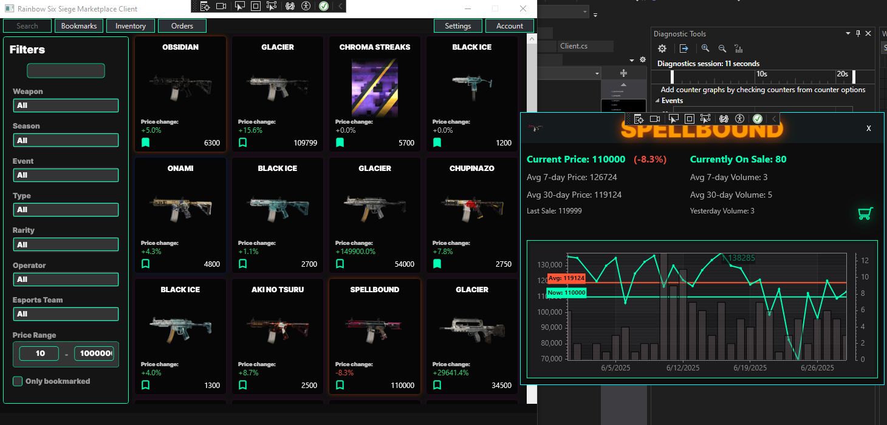

# r6marketplaceclient

### This program is mostly for my own use

For now, I'm using a compiled version of my [R6S API wrapper](https://github.com/liljaba1337/r6-marketplace), so you may need to build and reference it in the [.csproj file](https://github.com/liljaba1337/r6marketplaceclient/blob/master/r6marketplaceclient.csproj).

The design is ultra bad cuz I'm not a designer at all, but if someone wants to spend their time designing this project, I'll gladly accept any pull requests :3

